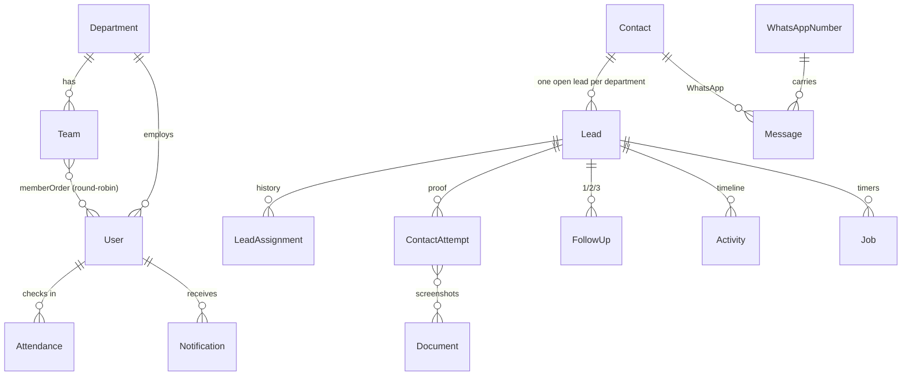

# Schema

MongoDB Atlas (M0 free in phase 1) + Mongoose 9. Models: `src/server/db/models/{org,leads,system}.ts`, exported from `src/server/db/models/index.ts` (`ALL_MODELS`). Input validation: `src/domain/schemas/index.ts` (Zod).

## Rules
- Enum values only in `src/domain/constants.ts`; typed defaults (`DEFAULT_STAGE`…) for model defaults. New enums must be classified in `ui-maps.ts` (UI map, label-only, or internal).
- Change model + Zod schema + indexes + this doc together (skill `new-model`).
- camelCase fields, `timestamps: true`. `createdBy`/`updatedBy` via `auditFields`; soft delete via `softDelete` (`deletedAt`, services filter `{ deletedAt: null }`). `activities` and `audit_logs` are insert-only (`insertOnly` plugin throws on update/delete).
- Phones E.164 (`+923001234567`); dates UTC (PKT for display; attendance `date` is the PKT `YYYY-MM-DD` key); money integer PKR (`…Pkr` suffix).
- Embed 1:1 data (lead `source`, `assignment`, `site`, `trading`); reference 1:many (attempts, follow-ups, activities, messages).
- Multi-document changes: `withTransaction` (`src/server/db/transaction.ts`).

## ERD

## Collections
| Collection | Key fields | Key indexes |
|---|---|---|
| `departments` | code (TRADING/INSTALLATION), name, stages, routingKeywords, workingHours | code unique |
| `teams` | departmentId, managerId, **memberOrder** (the only order), rr {lastUid, lastPos}, version, managerWindowMin, paused, acceptWithinMin, contactWithinMin, maxPendingAccept, autoMoveOnAcceptTimeout | departmentId |
| `user` | name, email, username, phone, role, departmentId, managerId, isActive, autoPausedAt, passwordHash (`select: false`, scrypt), mustChangePassword, lastLoginAt | email, username unique; {departmentId, role, isActive} |
| `sessions` | tokenHash (SHA-256 of the cookie token), userId, expiresAt, userAgent | tokenHash unique; TTL on expiresAt |
| `ratelimits` | key (e.g. login:user:x), count, resetAt | key unique; TTL on resetAt |
| `sheetrows` | rowKey, tab, status (ingested/skipped/failed), leadId, tries, error, sheetRow | rowKey unique; {tab, status} |
| `visits` | leadId, contactId, departmentId, customerName, phone, address, requirement, locationUrl, kw, scheduledAt, agentId (field agent), status, feedback, triedAgentIds[], assignedAt, completedAt | {agentId, status}; {status, scheduledAt} |
| `attendances` | userId, date (PKT key), status, checkInAt, lastCheckInAt, checkOutAt, breaks[], location | {userId, date} unique |
| `contacts` | name, phones[] (E.164), whatsappE164, email, city, area, address, type | phones unique (multikey) |
| `leads` | leadNo, contactId, departmentId, teamId, stage, stageChangedAt, status, closedAt, lostReason, wonValuePkr, closeReview {status none/pending/approved/rejected, by, at}, receivedAt, assignableAt, source {channel, rowKey, metaLeadId, submittedAt, campaign/adset/ad/form ids+names, platform, ctwa{sourceId, sourceType, sourceUrl, headline, body, mediaType, image/video/thumbnailUrl, ctwaClid, welcomeMessage}}, assignment {agentId, state, assignedAt, assignedBy, method, acceptedAt, bounces}, firstContactAt, lastContactAt, attemptCount, noAnswerStreak, nextFollowUpAt, site{}, trading{}, extra, version | leadNo unique; {departmentId, stage, status}; {assignment.agentId, status, nextFollowUpAt}; **partial unique {contactId, departmentId} where status open**; partial unique source.metaLeadId / source.rowKey |
| `leadassignments` | leadId, agentId, by (null = system), method, assignedAt, acceptedAt, endedAt, reason | {leadId, assignedAt}, {agentId, assignedAt} |
| `contactattempts` | leadId, agentId, channel, followUpNo, serverTapAt, leftAt, returnedAt, outcomeAt, result, response, remarks, durationSec, proof {docIds, phash, messageIds}, proofStatus, flags[], review {status, by, at, note}, recording? | {leadId, serverTapAt}, {agentId, serverTapAt}, {proofStatus, review.status} |
| `followups` | leadId, agentId, number, dueAt, status, outcome, attemptId, completedAt | {agentId, status, dueAt} |
| `activities` | leadId, type, actorId, at, data — insert-only | {leadId, at} |
| `auditlogs` | entity, entityId, action, before, after, actorId, at — insert-only | {entity, entityId, at} |
| `jobs` | kind, leadId, assignmentId, userId, dueAt, status, dedupeKey, tries, lastError | {status, dueAt}; dedupeKey partial unique |
| `locks` | _id (tick / sheet-pull), until, holder | — |
| `notifications` | userId, type, title, body, link, dedupeKey, readAt | dedupeKey unique; TTL 90 days |
| `pushsubscriptions` | userId, endpoint, keys {p256dh, auth} | endpoint unique |
| `documents` | ownerType, ownerId, category, fileName, mime, size, storageKey, uploadedBy, deletedAt | {ownerType, ownerId} |
| `whatsappnumbers` | phoneNumberId, number, ownerType (agent/department), agentId, departmentId, status, connectedAt, lastEchoAt | phoneNumberId unique |
| `messages` | waMessageId, contactId, leadId, numberId, direction, type, text, mediaStorageKey, sentFrom, sentByUserId, status, at | waMessageId unique; {contactId, at}; {leadId, at} |
| `settings` | key, value, updatedBy | key unique |
| `ingestevents` | source, idempotencyKey, payload, status, error, receivedAt | idempotencyKey unique; TTL 30 days |
| `counters` | _id (lead/quotation/sale), seq — `nextSequence(name)` | — |

Later (phases 3–4): products, price_history, quotations (items + price snapshot embedded, one doc per version), site_surveys, sales, payments, commissions, commission_rules, targets, campaigns.

## PDF §22 mapping
agents → `user` (role) · calls → `contactattempts` · lead_activities → `activities` · customer_requirements → `lead.site` / `lead.trading` · quotation_items → embedded · quotation_versions → one doc per version · product_prices → price_history.

## Scripts
- `npm run seed` — demo data into an empty DB (`-- --reset` wipes and reseeds). Needs `MONGODB_URI` in `.env.local`.
- `npm run db:indexes` — sync indexes to the schemas.
